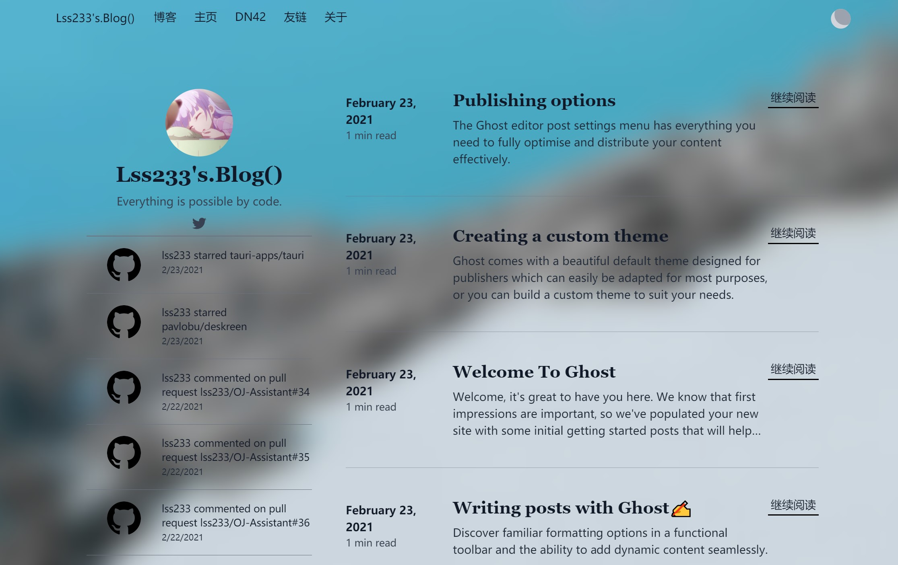

# Vanilla

A clean solo author blogging theme for Ghost.

[](https://github.com/TryGhost/Ghost)
[](https://github.com/lss233/Ghost-Vanillia/actions/workflows/build.yml) 
[](https://github.com/lss233/Ghost-Vanillia/releases)

  
## Installation
* [Stable Version](https://github.com/lss233/Ghost-Vanillia/releases/latest/)
* [Development Version](https://github.com/lss233/Ghost-Vanillia/archive/built.zip)

## Demo
[Lss233's.Blog();](https://blog.lss233.com) is currently using this theme.

## Features & Usages

### Dark Mode
You can toggle dark mode on the right of the navbar.  

### Table of Content
When you are viewing a passage, you can find the table of content on the navbar.


### Image CDN
To load your images from CDN, you need navigate to `Code Injection` > `Site Header` add following code:
```html
<script>
    var CDN_URL = 'https://your-cdn-url-prefix';
</script>
```
All of your images urls start with `/content/` will be replaced with `CDN_URL/content/...`  
If you are looking for a CDN to serve these images, I recommend [Cloudinary](https://cloudinary.com/invites/lpov9zyyucivvxsnalc5/dreuckyu6z3b5wm8y0as?kind=twitter&t=fast) for this.

### Unsplash CDN
Insert the following code into `Ghost Admin` -> `Code injection: Site Header`, and modify the url with yours.
```html
<script>
    var UNSPLASH_URL = 'https://your-cdn-url-prefix';
</script>
```
This will make image urls start with `https://images.unsplash.com` to be replaced with `UNSPLASH_URL`.

### Personal Feeds
This theme can display your recent activities in the left side of your home page.  
Currrently support:
* Telegram Channel
* Twitter
* _Instagram_
* Netease Cloud Music
* Github
To enable this feature, insert the following code into `Ghost Admin` -> `Code injection: Site Header`, and modify them with yours.
```html
<script>
var feedConfig = {
    server:"the server url to retrieve your feeds",
    twitter:"your twitter username",
    instagram:"your instagram username",
    github:"your github username",
    ncm:"your netease cloud music id",
    telegram: "your telegram channel username"
}
</script>
```
There is a PHP implemention of server based on RSS, you can checkout [here](https://gist.github.com/lss233/bd48efbf497f2a7c353dd78f7f247b47).  
Or you can use mine if you don't mind. `https://lss233.com/feeds.php` (Unsupport telegram)

* Disqus Comment
To enable disqus comment, insert the following code into `Ghost Admin` -> `Code injection: Site Header`, and modify the domain with yours.
```html
<script>
    var DISQUS_DOMAIN = 'change-this.disuqs.com';
</script>
```
# Development
Vanilla styles are compiled using Gulp + SCSS. You will need at least Node 12.x and Yarn, Gulp-CLI installed globally.  
```shell
# Install dependenices
yarn
# Watching file changes
yarn dev
``` 
Now you can edit `assets/sass/`, which will be compiled to `assets/css` automatically.  
The `build` command can remove unused CSS, minify JavaScript and inline files and pack them into `dist/vanilla.zip`, which you can upload to your site.
```shell
yarn build
```

# Known Issues
1. Background blur effect is not supported in Firefox.

## Bug Report & Feature Request
If you find a bug, thinking about something to be improved or want a new features, please feel free to create an issue.  
Pull Requests are appreciated.

# Dependencies
* [Tailwind CSS](https://tailwindcss.com/docs/responsive-design)
* [Tailwind Typography](https://github.com/tailwindlabs/tailwindcss-typography)
* [Nightwind](https://github.com/jjranalli/nightwind)

# License
This project is licensed under the [MIT License](LICENSE).
